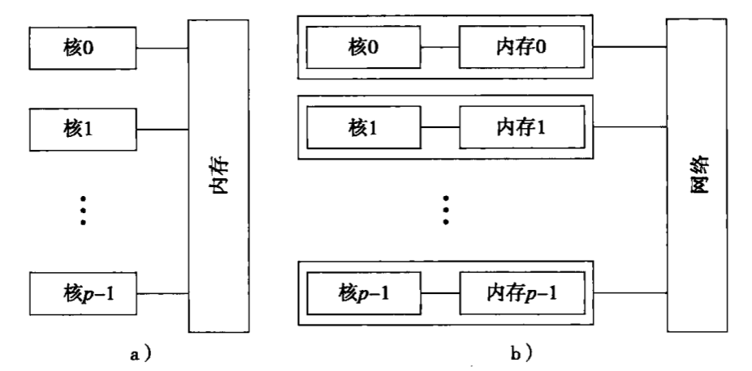

《并行程序设计导论》读书笔记，记录一些重要的知识点，以及一些自己的理解。 

<!-- more -->

# Ch1 为什么要并行计算
## 并行方案
1. 任务并行
   
    在任务并行方案中，将一个大任务分解为多个小任务，然后在多个核上并行地执行这些小任务。每个小任务可以独立地执行，从而提高整体的计算速度和效率。  
    常见的任务并行技术包括多线程、进程和任务队列等。
2. 数据并行
    数据并行是一种并行计算方案，它将大规模的数据集分割成多个小数据集，并使用多个核同时对这些小数据集进行相似的处理。每个处理单元可以独立地处理自己的数据，从而加快整体的数据处理速度。

    常见的数据并行技术包括分布式计算、GPU加速和数据流处理等。分布式计算可以将数据分发到多台计算机上进行并行处理，GPU加速利用图形处理器的并行计算能力来加速数据处理，而数据流处理则通过将数据分成多个流并行处理来提高效率。

## 学习内容
C语言的三个不同扩展
   1. 消息传递接口（Message Passing Interface，MPI）
   2. POSIX线程（Pthreads）
   3. OpenMP
## 并行系统
1. 共享内存系统
   - 共享内存系统是一种多核系统，它将多个核连接到同一个内存中，从而使得多个核可以共享同一个内存空间。这种系统的优点是通信简单，但缺点是扩展性差，因为所有核都需要访问同一个内存，容易造成内存访问冲突。
   - Pthreads和OpenMP都是共享内存系统的并行编程模型，它们都可以在多核系统上实现并行计算。
   - Pthreads和OpenMP的区别在于，Pthreads是一种底层的并行编程模型，需要手动管理线程的创建和销毁，而OpenMP是一种高层的并行编程模型，可以通过编译器自动插入并行指令来实现并行计算。
2. 分布式内存系统
    - 分布式内存系统是一种多机系统，它将多台计算机连接到同一个网络中，从而使得多台计算机可以共享数据。这种系统的优点是扩展性好，但缺点是通信复杂，因为需要通过网络传输数据。
    - MPI是分布式内存系统的并行编程模型，它可以在多台计算机上实现并行计算。

## 并发、并行、分布式
1. 并发（Concurrency）
    - 并发是指多个任务在同一时间段内执行，但不一定是同时执行。例如，操作系统可以在同一时间段内执行多个进程，从而提高系统的吞吐量。
2. 并行（Parallelism）
    - 并行是指多个任务在同一时间段内同时执行。例如，多核处理器可以在同一时间段内执行多个线程，从而提高系统的计算速度。
3. 分布式（Distributed）
    - 分布式是指多个计算机在网络上协同工作，共同完成一个任务。例如，互联网是一个分布式系统，它将全球各地的计算机连接在一起，从而实现信息的共享和传输。
