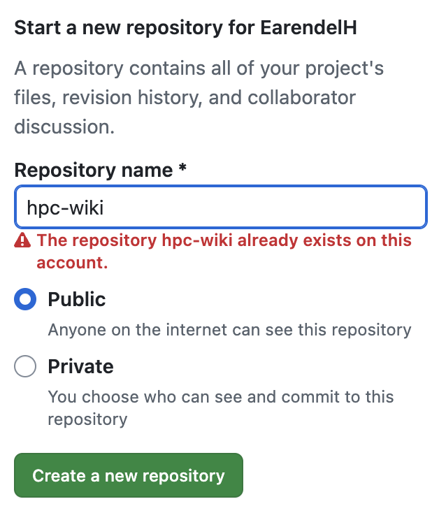
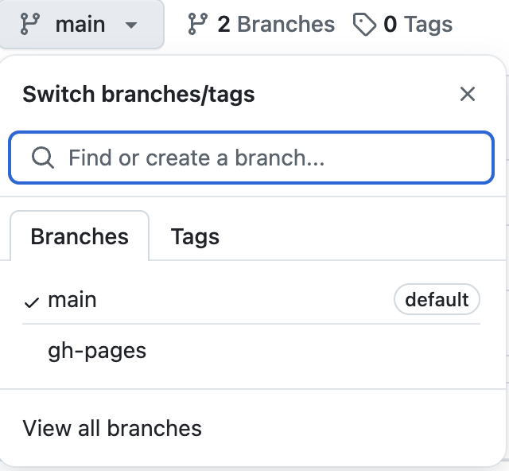
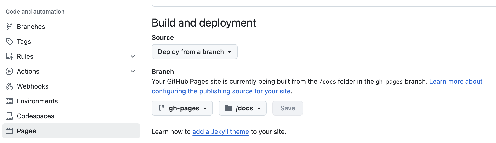
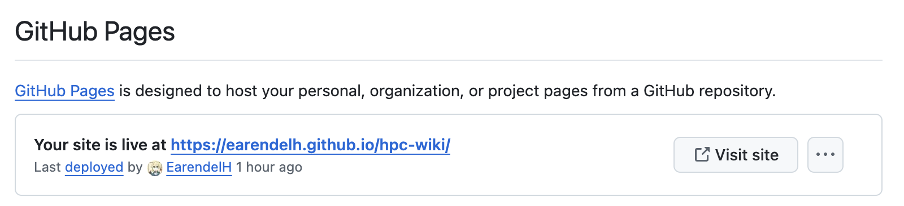

最近在打超算比赛的过程中想逐渐养成做记录的习惯，一是方便自己往后在部署同样或类似的环境时能够快速找到解决方案，二是发现有关超算环境等问题的wiki比较少，希望自己的记录能够帮助到其他人。在Notion上记录了一些内容，但是由于Notion的访问速度问题，以及一些草稿希望整理后再发布，恰巧发现了MkDocs这个工具，可以很方便的用来生成静态网站，建立自己的知识库，于是在此记录一下部署过程。
<!-- more -->

## Github repository 仓库的建立

在Github上新建一个repository，名字随意，我这里取名为'hpc-wiki'。



然后clone到本地，进入到该目录下。

```bash
git clone https://github.com/EarendelH/hpc-wiki.git
cd hpc-wiki
```
## MkDocs的安装

我这里使用的是pip安装，如果没有安装pip，可以参考[官方文档](https://mkdoc-material.llango.com/getting-started/)进行安装。

```bash
pip install mkdocs-material
```
## MkDocs的初始化

在当前目录下建立站点
```bash
mkdocs new .
```
这样就会在当前目录下生成一个mkdocs.yml文件和一个docs文件夹，docs文件夹下是我们的markdown文件。

> 注意：如果你按照官方教程或网上的一些教程，他会让你使用`mkdocs new my-project`这样的命令，这样会在当前目录下生成一个my-project文件夹，里面是mkdocs.yml和docs文件夹，这样的话你需要把my-project文件夹下的内容拷贝到当前目录下，这样会比较麻烦,部署时也可能会导致404等问题。

在mkdocs.yml文件中配置一些基本信息，比如站点名称，作者等。

```yaml
site_name: HPC Wiki
site_author: EarendelH
theme :
    name: material
```

更多的配置可以参考[官方文档](https://mkdoc-material.llango.com/setup/changing-the-colors/)

然后你就可以使用`mkdocs serve`来启动一个本地的web服务器，查看你的站点了。

```bash
mkdocs serve
```

## 部署到Github Pages

在部署之前我建议你使用`git`命令提交一次你的main分支，这样在接下来deploy的时候默认分支就不会是`gh-pages`，从而导致主工作区与网站源文件分支冲突。

```bash
git add .
git commit -m "first commit"
git push
```

然后使用`mkdocs gh-deploy`命令来部署到Github Pages。

```bash
mkdocs gh-deploy
```
这样子在当前目录下就会生成一个site文件夹，其中包含了你的静态网站的所有文件，然后会自动将这个文件夹push到`gh-pages`分支上。

现在的分支结构应该是这样的：
```bash
* main
  gh-pages
```


还没有完全结束，你需要在Github上的repository的Settings中找到Github Pages的设置，将Source设置为`deploy form a branch`，并将branch设置为`gh-pages`分支的docs文件夹。


设置成功的话你将会在此页面的上方看见如图样式，点击visit site即可访问你的网站。

